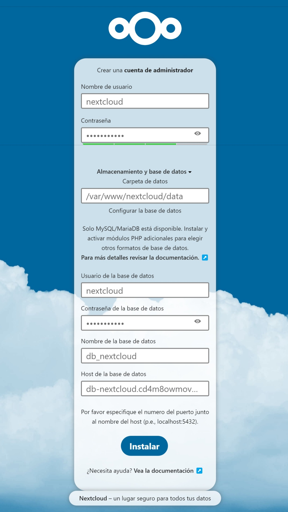

<h1><strong>NextCloud en instancia EC2 con RDS y S3</strong></h1>
<p>


</p>

<p><code><strong>¡Bienvenido a la guía de instalación de Nextcloud!</strong></code><br> Nextcloud es una solución de almacenamiento y colaboración en la nube de <strong>código abierto</strong> que te permite mantener el <strong>control de tus datos</strong>. Con <strong>Nextcloud</strong>, puedes crear tu propio servicio de nube de archivos, alojándolo en tu propio servidor o eligiendo un proveedor de alojamiento. A través de <strong>Nextcloud</strong>, puedes acceder a tus archivos desde cualquier lugar, sincronizarlos entre dispositivos y compartirlos con otros usuarios.
</p>
<p>
    El servidor <strong>Nextcloud</strong> está disponible:
    <ul>
        <li>Como servidor gratuito, con todas las funciones de la comunidad, con todas las características de la empresa.</li>
        <li>O con soporte empresarial completo, incluido el acceso telefónico y por correo electrónico a los desarrolladores de Nextcloud.</li>
    </ul>
</p>

<a id="RequisitosSistema"></a>
<details name="nextcloud">
    <summary><strong>Requisitos del sistema</strong></summary>
    <strong>Servidor</strong>
    <p>Para obtener el mejor rendimiento, estabilidad y funcionalidad, debes conocer algunas recomendaciones para ejecutar <strong>Nextcloud</strong>.
    <table>
        <thead>
            <tr>
                <th>Plataforma</th>
                <th>Opciones</th>
            </tr>
        </thead>
        <tbody>
            <tr>
                <td>Sistema operativo (64 bits)</td>
                <td>
                    <ul>
                        <li>
                            <strong>Ubuntu</strong> 22.04 LTS (recomendado)
                        </li>
                        <li>
                            <strong>Ubuntu</strong> 20.04 LTS
                        </li>
                        <li>
                            <strong>Red Hat</strong> Enterprise Linux 9 (recomendado)
                        </li>
                        <li>
                            <strong>Red Hat</strong> Enterprise Linux 8
                        </li>
                        <li>
                            <strong>Debian</strong> 12
                        </li>
                        <li>
                            <strong>SUSE</strong> Linux Enterprise Server 15
                        </li>
                        <li>
                            <strong>openSUSE</strong> Leap 15.5
                        </li>
                        <li>
                            <strong>CentOS</strong> Stream
                        </li>
                    </ul>
                </td>
            </tr>
            <tr>
                <td>Base de datos</td>
                <td>
                    <ul>
                        <li>
                            <strong>MySQL</strong> 8.0+ o <strong>MariaDB</strong> 10.3 ➡️ 10.5 ➡️ 10.6 (recomendado) ➡️ 10.11
                        </li>
                        <li>
                            <strong>Oracle Database</strong> 11g (sólo como parte de una suscripción empresarial)
                        </li>
                        <li>
                            <strong>PostgreSQL</strong> 12 ➡️ 13 ➡️ 14 ➡️ 15 ➡️ 16
                        </li>
                        <li>
                            <strong>SQLite</strong> (sólo recomendado para pruebas e instancias mínimas)
                        </li>
                    </ul>
                </td>
            </tr>
            <tr>
                <td>Servidor web</td>
                <td>
                    <ul>
                        <li>
                            <strong>Apache 2.4 </strong> con <code>mod_php</code> o <code>php-fpm</code> (recomendado)
                        </li>
                        <li>
                            <strong>nginx</strong> con <code>php-fpm</code>
                        </li>
                    </ul>
                </td>
            </tr>
            <tr>
                <td>Tiempo de ejecución de PHP</td>
                <td>
                    <ul>
                        <li>8.0 (obsoleto)</li>
                        <li>8.1</li>
                        <li>8.2 (recomendada)</li>
                        <li>8.3</li>
                    </ul>
                </td>
            </tr>
        </tbody>
    </table>

<strong>Arquitectura de CPU y SO</strong>

Para que Nextcloud funcione correctamente se necesita una CPU de 64 bits, un sistema operativo y PHP. Se admiten sistemas de 32 bits, pero va a tener las siguientes limitaciones:

<ul>
    <li>No se admiten fechas anteriores a Unix Epoch (1970-01-01)</li>
    <li>No se admiten fechas posteriores a 2038</li>
</ul>

<strong>Memoria</strong>

Los requisitos de memoria para ejecutar un servidor Nextcloud son muy variables, dependiendo del número de usuarios, aplicaciones, archivos y volumen de actividad del servidor.

Nextcloud necesita un mínimo de 128 MB de RAM por proceso, pero lo más recomendado es ampliar a un mínimo de 512 MB de RAM por proceso.

<strong>Requisitos de la base de datos para MySQL / MariaDB</strong>

Lo siguiente es actualmente necesario si está ejecutando Nextcloud junto con una base de datos MySQL / MariaDB:

<ul>
    <li>Motor de almacenamiento InnoDB (MyISAM no es compatible).</li>
    <li>Nivel de aislamiento de transacciones "READ COMMITTED" (Consulte: Nivel de aislamiento de transacciones "READ COMMITTED" de la base de datos).</li>
    <li>Desactivado o BINLOG_FORMAT = ROW configurado Registro binario (Véase: https://dev.mysql.com/doc/refman/5.7/en/binary-log-formats.html).</li>
    <li>Para soporte Emoji (UTF8 4-byte) ver Activar soporte MySQL 4-byte.</li>
</ul>

<strong>Módulos PHP y configuración</strong>

En esta sección se listan todos los módulos PHP necesarios y opcionales. Puedes comprobar la presencia de un módulo escribiendo.
```bash
php -m | grep -i <nombre_del_módulo>
```
Si obtiene un resultado, el módulo está presente.

<strong>Nota</strong>: Consulte el <strong><a href="https://www.php.net/manual/en/extensions.php">manual de PHP</a></strong> para más información sobre módulos.

<table>
    <thead>
            <tr>
                <th colspan="2">Módulos</th>
            </tr>
        </thead>
    <tbody>
        <tr>
            <td>Requerido</td>
            <td valign="top">
                <ul>
                    <li>PHP module ctype</li>
                    <li>PHP module curl</li>
                    <li>PHP module dom</li>
                    <li>PHP module fileinfo (included with PHP)</li>
                    <li>PHP module filter (only on Mageia and FreeBSD)</li>
                    <li>PHP module GD</li>
                    <li>PHP module hash (only on FreeBSD)</li>
                    <li>PHP module JSON (included with PHP >= 8.0)</li>
                    <li>PHP module libxml (Linux package libxml2 must be >=2.7.0)</li>
                    <li>PHP module mbstring</li>
                    <li>PHP module openssl (included with PHP >= 8.0)</li>
                    <li>PHP module posix</li>
                    <li>PHP module session</li>
                    <li>PHP module SimpleXML</li>
                    <li>PHP module XMLReader</li>
                    <li>PHP module XMLWriter</li>
                    <li>PHP module zip</li>
                    <li>PHP module zlib</li>
                </ul>
            </td>
        </tr>
        <tr>
            <td>Conectores de base de datos (elija el que corresponda a su base de datos)</td>
            <td valign="top">
                <ul>
                    <li>Módulo PHP pdo_sqlite (>= 3, normalmente no recomendado por razones de rendimiento)</li>
                    <li>Módulo PHP pdo_mysql (MySQL/MariaDB)</li>
                    <li>Módulo PHP pdo_pgsql (PostgreSQL)</li>
                </ul>
            </td>
        </tr>
        <tr>
            <td>Paquetes recomendados</td>
            <td valign="top">
                <ul>
                    <li>Módulo PHP intl (aumenta el rendimiento de la traducción de idiomas y corrige la clasificación de caracteres no ASCII)</li>
                    <li>Módulo PHP  sodium (para Argon2 para hash de contraseñas. bcrypt se usa como fallback, pero si las contraseñas ya fueron hasheadas con Argon2 y falta el módulo, tus usuarios no podrán iniciar sesión).</li>
                </ul>
            </td>
        </tr>
        <tr>
            <td>Necesario para determinadas aplicaciones</td>
            <td valign="top">
                <ul>
                    <li>Módulo PHP ldap (para integración LDAP)</li>
                    <li>Módulo PHP smbclient (integración SMB/CIFS, véase <a src="https://docs.nextcloud.com/server/latest/admin_manual/configuration_files/external_storage/smb.html">SMB/CIFS</a>)</li>
                    <li>Módulo PHP ftp (para almacenamiento FTP / autenticación de usuario externo)</li>
                    <li>Módulo PHP imap (para la autenticación de usuarios externos)</li>
                    <li>Módulo PHP bcmath (para inicio de sesión sin contraseña)</li>
                    <li>Módulo PHP gmp (para inicio de sesión sin contraseña y almacenamiento SFTP)</li>
                    <li>Módulo PHP exif (para la rotación de imágenes en la aplicación de imágenes)</li>
                </ul>
            </td>
        </tr>
        <tr>
            <td>Para mejorar el rendimiento del servidor, seleccione una o varias de las siguientes memorias caché<br>
            <blockquote>Consulte <strong><a href="https://docs.nextcloud.com/server/latest/admin_manual/configuration_server/caching_configuration.html">Memoria caché</a></strong> para saber cómo seleccionar y configurar una caché.</blockquote>
            </td>
            <td valign="top">
                <ul>
                    <li>Módulo PHP ldap (para integración LDAP)</li>
                    <li>Módulo PHP apcu (>= 4.0.6)</li>
                    <li>Módulo PHP memcached</li>
                    <li>Módulo PHP redis (>= 2.2.6, necesario para el bloqueo transaccional de archivos)</li>
                </ul>
            </td>
        </tr>
        <tr>
            <td>Para la generación de vistas previas</td>
            <td valign="top">
                <ul>
                    <li>Módulo PHP imagick<br>
                    <blockquote><strong>Nota</strong><br>Si la generación de la vista previa de los archivos PDF falla con un mensaje de error "no autorizado", debe ajustar el archivo de política imagick. Consulte <strong><a href="https://cromwell-intl.com/open-source/pdf-not-authorized.html">https://cromwell-intl.com/open-source/pdf-not-authorized.html</a></strong></blockquote>
                    </li>
                    <li>avconv o ffmpeg</li>
                    <li>OpenOffice o LibreOffice</li>
                </ul>
            </td>
        </tr>
        <tr>
            <td>Para el procesamiento de la línea de comandos</td>
            <td valign="top">
                <ul>
                    <li>Módulo PHP pcntl (permite la interrupción de comandos pulsando <code>ctrl + c</code>)<br>
                    <blockquote><strong>Nota</strong><br>También necesita asegurarse de que <code>pcntl_signal</code> y <code>pcntl_signal_dispatch</code> no esten deshabilitados en su php.ini por la opción <code>disable_functions</code>.</blockquote>
                    </li>
                </ul>
            </td>
        </tr>
        <tr>
            <td>Para el actualizador de línea de comandos</td>
            <td valign="top">
                <ul>
                    <li>Módulo PHP phar (actualiza Nextcloud ejecutando <code>sudo -u www-data php /var/www/nextcloud/updater/updater.phar</code>)</blockquote>
                    </li>
                </ul>
            </td>
        </tr>
    </tbody>
</table>

<strong>Valores ini</strong>
<p>Los siguientes ajustes ini deben adaptarse si es necesario para <strong>Nextcloud</strong> en php.ini:</p>
<code>Cambia la versión 8.1 por la correspondiente a su php instalado.</code>

php.ini - utilizado por el servidor Web:
```bash
sudo nano /etc/php/8.1/apache2/php.ini
```
o
```bash
sudo nano /etc/php/8.1/fpm/php.ini
```
php.ini - usado por php-cli y por los trabajos CRON de Nextcloud:
```bash
sudo nano /etc/php/8.1/cli/php.ini
```
<ul>
    <li><code>apc.enable_cli</code>: ver <a href="https://docs.nextcloud.com/server/latest/admin_manual/configuration_server/caching_configuration.html"><strong>Memoria caché</strong></a>.</li>
    <li><code>disable_functions</code>: evite desactivar funciones a menos que sepa exactamente lo que está haciendo.</li>
    <li><code>max_execution_time</code>: véase <a href="https://docs.nextcloud.com/server/latest/admin_manual/configuration_files/big_file_upload_configuration.html"><strong>Carga de archivos grandes > 512 MB</strong></a>.</li>
    <li><code>memory_limit</code>: debe ser de al menos 512MB. Ver también <a href="https://docs.nextcloud.com/server/latest/admin_manual/configuration_files/big_file_upload_configuration.html"><strong>Subir archivos grandes > 512MB</strong></a>.</li>
    <li><code>open_basedir</code>: véase <a href="https://docs.nextcloud.com/server/latest/admin_manual/installation/harden_server.html"><strong>Guía de seguridad y refuerzo</strong></a>.</li>
    <li><code>upload_tmp_dir</code>: ver <a href="https://docs.nextcloud.com/server/latest/admin_manual/configuration_files/big_file_upload_configuration.html"><strong>Cargar archivos grandes > 512MB</strong></a>.</li>
</ul>
</p>
<a href="#RequisitosSistema"><strong> </strong></a>
</details>

<a id="RDS"></a>
<details name="nextcloud">
<summary><strong>Crear una base de datos MariaDB en RDS</strong></summary>
<ol>
<li><strong>Configuración de la base de datos</strong><br>
A continuación te presentaré la configuración de la base de datos, si recién estás comenzando, te recomiendo seguir primero esta configuración y luego aplicar tus propios cambios personalizados con otra práctica.<p>
<ul>
<li>Método de creación ➡️ <code>Creación estándar</code></li>
<li>Opciones del motor ➡️ <code>MariaDB</code></li>
<li>Plantilla ➡️ <code>Capa gratuita</code></li>
<li>Identificador de base de datos ➡️ <code>db-nextcloud</code></li>
<li>Usuario maestro ➡️ <code>nextcloud</code></li>
<li>Contraseña maestra ➡️ <code>la que gustes</code></li>
<li>Nube privada virtual ➡️ <code>Para el ejemplo dejaremos la VPC por defecto, pero lo recomendable es crear tu VPC o seleccionar una para tener un mayor control de nuestra base de datos</code></li>
<li>Acceso público ➡️ <code>Sí, pero lo más recomendable es que no sea pública porque así evitamos ataques y no es necesario dejarla pública, ya que si intentamos conectar RDS con la instancia EC2 se conectará normalmente por estar en la misma red.</code></li>
<li>Grupos de seguridad ➡️ <code>la dejamos en <strong>default</strong>, pero podrías crear o seleccionar una que ya tenga las <strong>reglas de entrada</strong> que agregaremos más adelante</code></li>
<li>Configuración adicional ➡️ Opciones de base de datos ➡️ Nombre de base de datos inicial ➡️ <code>nextcloud</code></li>
</ul>
</li>

<li><strong>Agregar regla de seguridad</strong><br>
<ul>
    <li>
        Esperamos que cambie a <strong>disponible</strong> y damos click en el identificador de la base de datos <strong>db-nextcloud</strong>.
        
    </li>
    <li>
        Abrimos el grupo de seguridad.
        
    </li>
    <li>
        Abrimos el <strong>ID de grupo de seguridad</strong>.
        
    </li>
    <li>
        Click en <code><strong>Editar reglas de entrada</strong></code>.
        
    </li>
    <li>
        Click en <code><strong>Agregar regla</strong></code> y especificamos lo siguiente.
        
    </li>
</ul>
</li>
</p>
</ol>
<a href="#RDS"><strong> </strong></a>
</details>

<a id="CrearUsuarioIAM"></a>
<details name="nextcloud">
    <summary> <strong>Crear un usuario en IAM</strong></summary>
    <p>
    Crearemos un usuario con privilegios <strong>AmazonS3FullAccess</strong> el cual nos servirá para ingresarlo en el servidor <strong>NextCloud</strong> y nos cree automáticamente una instancia en el servicio S3.
    <ol>
    <li>Buscamos el servicio <strong>IAM</strong>.</li>
    <li>En el panel izquierdo, seleccionamos <strong>usuarios</strong>.</li>
    <li>Seleccionamos <strong></strong>.<br>
    
    </li>
    <li>Nombre de usuario ➡️ nextcloud o cualquier nombre que desees, click en <strong></strong>.<br>
    
    </li>
    <li>Seleccionamos <strong>Adjuntar políticas directamente</strong>, buscamos y seleccionamos <strong>AmazonS3FullAccess</strong>, click en <strong></strong>.<br>
    <br>
    Y por último, <strong></strong>
    </li>
    <li>Seleccionamos nuestro usuario y nos vamos a <strong>Credenciales de seguridad</strong>.<br>
    <br>
    Bajamos hasta <strong>Claves de acceso y</strong> click en <strong>Crear clave de acceso</strong>
    </li>
    <li>Seleccionamos <strong>Interfaz de línea de comandos (CLI)</strong>, marcamos la casilla de confirmación y click en <strong></strong>.<br>
    
    </li>
    <li>Puedes colocar un nombre a tu llave de acceso, click en <strong></strong>.<br>
    
    </li>
    <li>Descargamos nuestra llave de acceso porque la necesitaremos más adelante y click en <strong></strong>.<br>
    
    </li>
    </ol>
    </p>
    <a href="#CrearUsuarioIAM"><strong> </strong></a>
</details>

<a id="CrearUnaInstanciaEC2"></a>
<details name="nextcloud">
    <summary><strong>Crear una instancia EC2</strong></summary>
    <p>
    En esta sección crearemos una instancia EC2 para posteriormente instalar el servidor <strong>NextCloud</strong>.
    <ol>
        <li>En el buscador escribimos <strong>EC2</strong>.</li>
        <li>Click en <strong>lanzar instancia</strong>.</li>
        <li>
            <strong>Nombre</strong> ➡️ <code>server-nextcloud</code>.
            
        </li>
        <li>
            <strong>Imagen de máquina de Amazon</strong> ➡️ <code>Ubuntu</code>.    
            
        </li>
        <li>
            <strong>Par de claves</strong> ➡️ <code>Seleccionar una existente o crear una nueva</code>.
            
        </li>
        <li>
            <strong>Configuracion de red</strong><br>
            ✅ Permitir el tráfico de SSH desde <code>cualquier lugar</code>.<br>
            ✅ Permitir el tráfico de HTTPS desde internet.<br>
            ✅ Permitir el tráfico de HTTP desde internet.<br>
            
        </li>
        <li>
            <strong>Asignar dirección IP elástica</strong> ➡️ <code>En el panel izquierdo seleccionamos <strong>Direcciones IP elásticas</strong> y click en <strong>Asignar la dirección IP elástica</strong> y click en <strong>Asignar</strong></code>.
            
            <br>
        </li>
        <li>
            <strong>Asociar dirección IP a instancia EC2</strong><br>
            ➡️ <code>Click en <strong>Asociar esta dirección IP elástica</strong>.</code><br>
            ➡️ <code>Seleccionamos la instancia <strong>server-nextcloud</strong>.</code><br>
            ➡️ <code>Y por último  <strong>✅ Permitir que se vuelva asociar esta dirección IP elástica</strong>.</code>
            
            
        </li>
    </ol>
    </p>
    <a href="#CrearUnaInstanciaEC2"><strong> </strong></a>
</details>

<a id="InstalacionNextcloud"></a>
<details name="nextcloud">
<summary><strong>Instalación de NextCloud en Ubuntu 22.04 LTS</strong></summary>
<p>
<ol>
<li><p>Actualizamos nuestro Ubuntu.</p>

```bash
sudo apt update
```    
<p></p>

```bash
sudo apt upgrade
``` 
</li>
<li><p>Continuamos con la instalación de los módulos requeridos y recomendados para <strong>Nextcloud</strong>.</p>

```bash
sudo apt install apache2 libapache2-mod-php php-gd php-mysql php-curl php-mbstring php-intl php-gmp php-bcmath php-xml php-imagick php-zip
```    
<p>Esto instala los paquetes para el núcleo del sistema <strong>Nextcloud</strong>. libapache2-mod-php proporciona las siguientes extensiones PHP:<br>
<code>bcmath bz2 calendar Core ctype date dba dom ereg exif fileinfo filter ftp gettext hash iconv libxml mhash openssl pcre Phar posix Reflection session shmop SimpleXML soap sockets SPL standard sysvmsg sysvsem sysvshm tokenizer wddx xmlreader xmlwriter zlib</code>

Si estás planeando ejecutar aplicaciones adicionales, ten en cuenta que pueden requerir paquetes adicionales.</p>
</li>
<li>
<p>Ahora descargamos el archivo de la última versión de <strong>Nextcloud</strong>.</p>

```bash
sudo wget https://download.nextcloud.com/server/releases/latest.tar.bz2
```
</li>
<li>
<p>Descargamos el archivo para comprobar la integridad del paquete.</p>

```bash
sudo wget https://download.nextcloud.com/server/releases/latest.tar.bz2.md5
```
</li>
<li>
<p>Verificación del paquete <strong>NextCloud</strong>.</p>

```bash
md5sum -c latest.tar.bz2.md5 < latest.tar.bz2
```
</li>
</li>
<li>
<p>También puede verificar la firma <strong>PGP</strong>, descargamos los dos siguientes archivos:</p>

```bash
sudo wget https://download.nextcloud.com/server/releases/latest.tar.bz2.asc
```
> <strong>PGP</strong> (Pretty Good Privacy) es una <strong>metodología de cifrado de datos</strong> que se utiliza para cifrar, descifrar y autenticar archivos digitales y comunicaciones en línea. Funciona mediante una combinación de <strong>técnicas de cifrado</strong>, como hash, compresión de datos, criptografía simétrica de clave privada y criptografía asimétrica de clave pública, con el <strong>objetivo de mantener la seguridad de los datos</strong>. Para más detalles, lee el siguiente artículo  <strong><a target="_blank" href="https://www.kaspersky.es/blog/pgp-privacidad-seguridad-y-autenticacion-fiables-para-todos/1781/">PGP – Privacidad, seguridad y autenticación fiables para todos</a></strong>.


<p>Y luego.</p>

```bash
sudo wget https://nextcloud.com/nextcloud.asc
```
<p>Importamos.</p>

```bash
sudo gpg --import nextcloud.asc
```
<p>Verificamos.</p>

```bash
sudo gpg --verify latest.tar.bz2.asc latest.tar.bz2
```
</li>
<li>
<p>Ahora puede extraer el contenido del archivo para instalar <strong>NextCloud</strong>.</p>

```bash
sudo tar -xjvf latest.tar.bz2
```
</li>
<li>
<p>Copiamos el directorio generado a la siguiente ruta.</p>

```bash
sudo cp -r nextcloud /var/www
```
</li>
<li>
<p>Cambiamos los permisos de la carpeta para tener acceso.</p>

```bash
sudo chown -R www-data:www-data /var/www/nextcloud
```
</li>
<li>
<p>Configuración del servidor web <strong>Apache</strong>. La configuración de <strong>Apache</strong> requiere la creación de un único archivo de configuración. En <strong>Debian, Ubuntu y sus derivados</strong>, este archivo será.</p>

```bash
sudo nano /etc/apache2/sites-available/nextcloud.conf
```

<p>En <strong>Fedora</strong>, <strong>CentOS</strong>, <strong>RHEL</strong> y <strong>sistemas similares</strong>, el archivo de configuración será.</p>

```bash
sudo nano /etc/httpd/conf.d/nextcloud.conf
```
<p>Para utilizar la instalación basada en directorios, coloca lo siguiente en tu nextcloud.conf sustituyendo las rutas de archivos <strong>Directory</strong> y <strong>Alias</strong> por las rutas de archivos apropiadas para tu sistema:</p>

```apache
Alias /nextcloud "/var/www/nextcloud/"

<Directory /var/www/nextcloud/>
    Require all granted
    AllowOverride All
    Options FollowSymLinks MultiViews

    <IfModule mod_dav.c>
        Dav off
    </IfModule>
</Directory>
```
</li>
<li>
<p>Para utilizar la instalación de host virtual, colocar lo siguiente en tu <strong>nextcloud.conf</strong> sustituyendo <strong>ServerName</strong>, así como las rutas de archivo <strong>DocumentRoot</strong> y <strong>Directory</strong> por valores apropiados para tu sistema:</p>
<code>Recomendada</code>

```apache
<VirtualHost *:80>
    DocumentRoot /var/www/nextcloud/
    ServerName  tu.servidor.com

    <Directory /var/www/nextcloud/>
        Require all granted
        AllowOverride All
        Options FollowSymLinks MultiViews

        <IfModule mod_dav.c>
            Dav off
        </IfModule>
    </Directory>
</VirtualHost>
```
<p>En <strong>Debian</strong>, <strong>Ubuntu</strong> y <strong>sus derivados</strong>, debe ejecutar el siguiente comando para activar la configuración:</p>

```bash
sudo a2ensite nextcloud.conf
```
</li>
<li>
<p>Para que <strong>Nextcloud</strong> funcione correctamente, necesitamos el módulo <code>mod_rewrite</code>.</p>

```bash
sudo a2enmod rewrite
```
</li>
<li>
<p>Otros módulos recomendados son <code>mod_headers</code>, <code>mod_env</code>, <code>mod_dir</code> y <code>mod_mime</code>:</p>

```bash
sudo a2enmod headers
```
```bash
sudo a2enmod env
```
```bash
sudo a2enmod dir
```
```bash
sudo a2enmod mime
```
</li>
<li>
<p>Si está ejecutando <code>mod_fcgi</code> en lugar del estándar <code>mod_php</code> también habilitar:</p>

```bash
sudp a2enmod setenvif
```
</li>
<li>
<p>Reiniciamos <strong>apache</strong>.</p>

```bash
sudo service apache2 restart
```
</li>
<li>
<p>Asegúrate de que apache tiene acceso de lectura y escritura a toda la carpeta nextcloud.</p>

```bash
sudo chown -R www-data:www-data /var/www/nextcloud/
```

</li>
<li>
<p>Reiniciamos <strong>apache</strong>.</p>

```bash
sudo service apache2 restart
```
</li>
<li>
<p>Copiar la <strong>Dirección IP pública</strong> de nuestra instancia <strong>EC2</strong> y pegarla en una ventana. Donde configuramos lo siguiente:</p>
<strong>Nombre de usuario</strong> ➡️ El nombre de usuario para iniciar sesión con <strong>NextCloud</strong>.<br>
<strong>Contraseña</strong> ➡️ La contraseña para iniciar sesión con <strong>NextCloud</strong>.<br>
<strong>Carpeta de datos</strong> ➡️ Dejar la ruta que viene por defecto.<br>
<strong>Usuario de la base de datos</strong> ➡️ El mismo cuando se creo la base de datos en <strong>RDS</strong>.<br>
<strong>Contraseña de la base de datos</strong> ➡️ La misma cuando se creo la base de datos en <strong>RDS</strong>.<br>
<strong>Nombre de la base de datos</strong> ➡️ Puedes colocar cualquier nombre, diferente al que se creo en <strong>RDS</strong>.<br>
<strong>Host de la base de datos</strong> ➡️ Punto de enlace de la base de datos, también junto a el le añadiremos el puerto<strong>RDS</strong>.<br>
Ejemplo: db-nextcloud.cd4m8owmovw4.us-east-1.rds.amazonaws.com:3306<br><br>

<br>

Al dar en <strong>instalar</strong> se va a demorar un poco mientras se crea la base de datos y demás configuraciones en <strong>NextCloud</strong>, ser paciente, por favor.
</li>
<li>
<p><strong>NextCloud</strong> nos recomienda instalar <strong>Aplicaciones</strong> que pueden ser de utilidad, así que te recomiendo instalarlas.</p>

</li>
<li>
<p>Nos visualiza alguna de las tareas que podemos realizar en <strong>NextCloud</strong>.</p>

</li>
<li>
<p>Nos menciona que podemos integrar <strong>NextCloud</strong> con diferentes plataformas, ya sea móvil o escritorio.</p>

</li>
<li>
<p>Más sobre <strong>NextCloud</strong>.</p>


</li>
<li>
<p>Miramos los archivos que vienen por defecto en <strong>NextCloud</strong>, Presionamos en el icono del usuario y damos click en <strong>Aplicaciones</strong>.</p>

</li>
<li>
<p>Vamos a <strong>Apps deshabilitadas</strong> y activamos <strong>External storage support</strong>.</p>

</li>
<li>
<p>Vamos a <strong>Ajustes personales</strong> y si gustan configuran sus datos personales.</p>


</li>
<li>
<p>Nos desplazamos hacia abajo en el panel izquierdo y seleccionamos <strong>Almacenamiento externo</strong> y configuran lo siguiente:</p>
<strong>Almacenamiento externo</strong> ➡️ Amazon S3.<br>
<strong>Autenticación</strong> ➡️ Clave de acceso.<br>
<strong>Bucket</strong> ➡️ Nombre del bucket en S3 en minúsculas, puede ser cualquiera ya que con este se creara en el servicio S3.<br>
<strong>ID de la clave de acceso</strong> ➡️ Debes tenerlo del usuario que se creo previamente en <strong>IAM</strong>.<br>
<strong>Clave de acceso secreta</strong> ➡️ Debes tenerla del usuario que se creo previamente en <strong>IAM</strong>.<br>
<strong>Disponible para</strong> ➡️ Todos los usuarios, caso contrario que tengas multiples usuarios, debes seleccionar en el que desees el almacenamiento externo.<br>
<strong>Nombre de la carpeta</strong> ➡️ Si gusta cambia el nombre, es como se visualizara en su <strong>NextCloud</strong>.<br><br>
<br>
Por último, click en el ✅ de la derecha, si todo está bien, debería salir verde la ✅ de la izquierda, si no revise su configuración.
</li>
<li>
<p>Si vamos hacia los archivos notaremos que ya tenemos una carpeta, en mi caso <strong>AmazonS3</strong> donde podemos alojar cualquier tipo de archivo, los cuales se almacenaran en nuestro bucket <strong>S3</strong> y así obtendremos más almacenamiento.</p>
<br>
Revisar en el servicio S3 para comprobar la existencia de un nuevo bucket.
</li>
</ol>

<a href="#InstalacionNextcloud"><strong> </strong></a>

</details>

<h2>Referencias</h2>
<a href="https://docs.nextcloud.com/server/latest/admin_manual/installation/example_ubuntu.html" rel="nofollow"></a>
<a href="https://docs.nextcloud.com/server/latest/admin_manual/installation/source_installation.html#apache-configuration-label" rel="nofollow"></a>
<a href="https://docs.nextcloud.com/server/latest/admin_manual/configuration_files/external_storage_configuration_gui.html" rel="nofollow"></a>
<a href="https://docs.nextcloud.com/server/latest/admin_manual/configuration_files/external_storage/amazons3.html" rel="nofollow"></a>